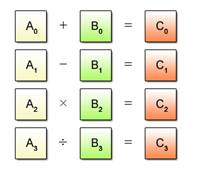

El lenguaje ensamblador puede ser una buena herramienta a la optimizacion del rendimiento de shaders de particulas fisicas dentro de los efectos 
especiales como lo son el fuego, el agua, las explosiones, pasto, nieve, nubes o las personas. Los shaders en sus inicios fueron creados en un
ensamblador perteneciente a nVidia, pero despues Microsoft creo el DirectX 8.1 SDK , el cual era un ensamblador que funcionaba en Direct3D 
(la cual permitia crear graficos 3d), Aunque actualmente se usa lenguajes de alto nivel como  HLSL o GLSL (que son similares a C), comprender su 
funcionamiento puede ser de ayuda para optimizar secciones criticas del codigo grafico y para tener un entendimiento mas profundo de como interactua
el software con el hardware gráfico.

En una situacion asi la CPU y la GPU deben manejar gran cantidad de cálculos en tiempo real, como la física de los objetos o la renderización de 
gráficos,el ensamblador podria optimizar esas tareas reduciendo el uso innecesario de ciclos de CPU. Por ejemplo, se podria usar (SIMD) el cual es un
un método informático que permite procesar múltiples datos con una sola instrucción como aparece en la imagen

 

Aunque esta solo pueda hacer estos calculos con un solo tipo de operacion, y no con varias como sumas,  restas, multiplicacion y division al mismo
tiempo, igualmente llega a ser una excelente herramienta

 
