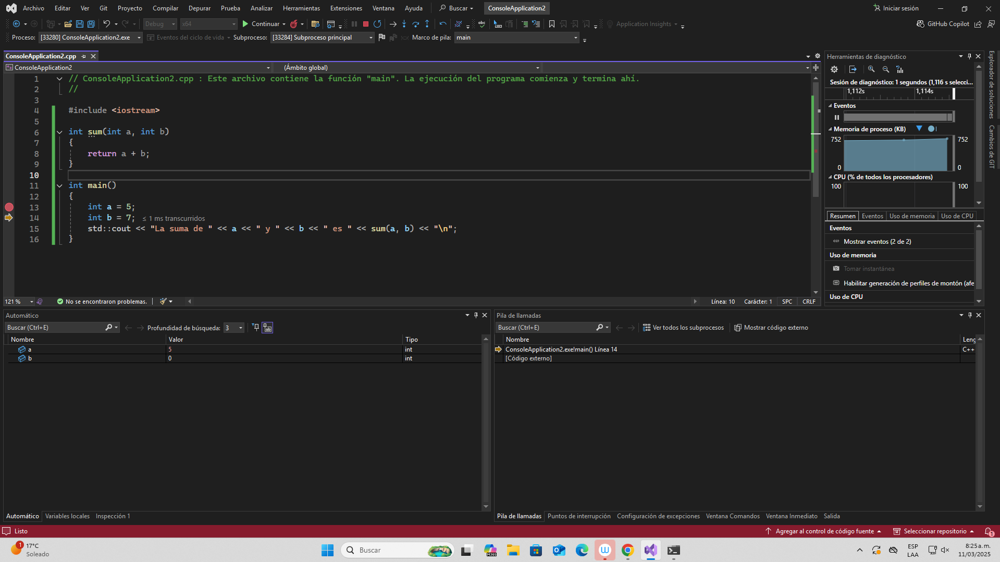

#### ¿Qué hace cada una de estas opciones?
 
El boton rojo hace que la depuracion se detenga, esta se podra volver a retomar si se usa la tecla
f5 o el boton "Depurador local de Windows" , el circulo dando vueltas es para reiniciar la depuracion, la 
flecha hacia abajo es la cual toma cada instruccion del codigo, entonces si hace un return, saltara a la linea
donde esta este, encambio la cual es una flecha saltando un punto es la cual va paso a paso en los procedimientos
de forma cronologica mas no los procesa como su opcion pasada.
Por ultimo la flecha señalando arriba toma el paso a paso del codigo para salir y terminar de ejecutar el programa.
