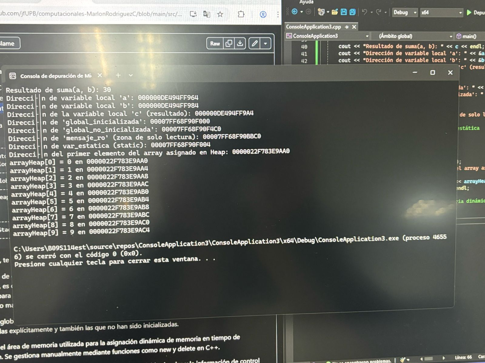

``` bash
+-------------------------------+
|       Segmento de código      |
|   (instrucciones, funciones)  |
+-------------------------------+
| Variables globales y estáticas|
+-------------------------------+
|           Heap                | <--- Asignación dinámica (new/malloc)
|                               |
|                               |
+-------------------------------+
|           Stack               | <--- Variables locales
+-------------------------------+
``` 

``` bash
+----------------------------------------------------------------------+
| main, suma, funcionConStatic()                                       |
|      crearArrayHeap()                                                |
+----------------------------------------------------------------------+
|'global_inicializada': 00007FF77989F000,                              |
|'global_no_inicializada': 00007FF77989F4C0                            |
|mensaje_ro	0x00007ff7d230bbc0 "Hola, memoria de solo lectura"         |
|var_estatica (static): 00007FF7D230F004                               |
+----------------------------------------------------------------------+
| arrayHeap[0] = 0 en 000001D27C6D4480                                 |
| arrayHeap[9] = 9 en 000001D27C6D44A4                                 |
+----------------------------------------------------------------------+
|variable local 'a': 000000B2AA3EF934                                  | <--- Variables locales
|variable local 'b': 000000B2AA3EF954                                  |
|variable local 'c' (resultado): 000000B2AA3EF974                      |
+----------------------------------------------------------------------+
``` 

