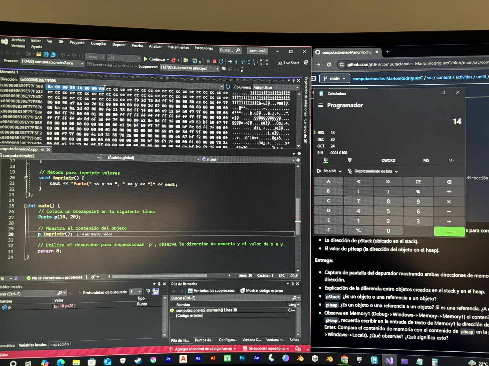

Al escribir 0A en hexadecimal, dentro del valor decimal obtengo 10 decimal y al escribir 
14 en Hexadecimal, dnetro de valor decimal obtengo 20, los cuales son los valores declarados
dentro del codigo

00 00 00 14 00 00 00 0a

El constructor es una funcion que ocurre cuando se crea un objeto y el destructor cuando 
este objeto termina su funcionamiento  y se destruye

Al igual que en otros lenguajes de programacion la clase es una guia o plantilla que define 
que hara el objeto y el objeto es una creacion apartir de la clase, por ejemplo en minecraft
existe la clase "espada" pero existen diversos objetos como espada de madera, espada de hierro,
espada de diamante etc

Dentro de C++  el punto es un objeto y en C# es una referencia a un objeto 
esto lo demuestra en la linea Punto p = new Punto(10, 20); --- y en el caso de C++ este
guardaria p automaticamente en stack y en C# usa el heap al usar el new 

 
Aprendi que "p" se utiliza el tipo de memoria en little-endian y estos se representan en
bytes, y como se representan en bytes, los objetos en C++ son creaciones apartir de clases
